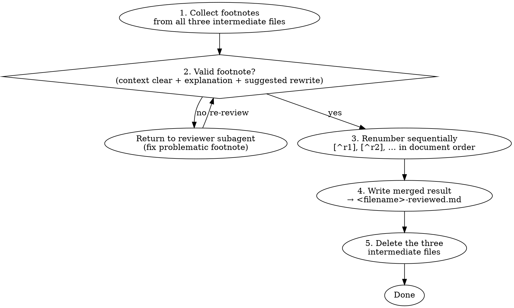
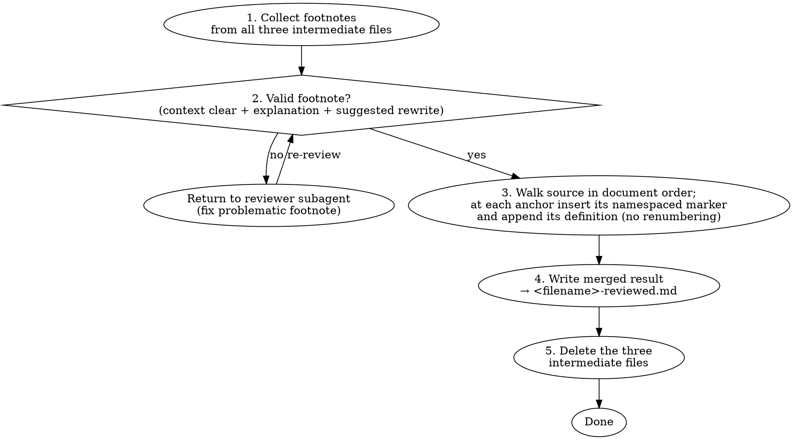

# review-article Namespaced Footnotes Implementation Plan

> **For agentic workers:** REQUIRED SUB-SKILL: Use superpowers:subagent-driven-development (recommended) or superpowers:executing-plans to implement this plan task-by-task. Steps use checkbox (`- [ ]`) syntax for tracking.

**Goal:** Replace the merge step's manual `[^rN]` renumbering with per-reviewer namespaced footnote labels (`[^pN]`/`[^aN]`/`[^gN]`) and a standardized reviewer output format, so renumbering and cross-reviewer collisions are impossible by construction.

**Architecture:** Three Markdown reviewer prompt templates get a namespaced label + standardized Anchor/Note output format; `SKILL.md`'s merge diagram, merge prose, and self-review wording change from "renumber to `[^rN]`" to "insert namespaced markers in document order." No code; verification is grep assertions plus one manual end-to-end run.

**Tech Stack:** Markdown skill files; `grep` for verification; the `review-article` skill itself for the manual run.

## Global Constraints

- Labels are namespaced by reviewer: prose `[^pN]`, argument `[^aN]`, grounding `[^gN]`. No reviewer emits a bare `[^N]` or a `[^rN]`.
- Reviewer output uses the exact format: a `## Footnotes` list, each entry a `### [^xN]` heading with `**Anchor:**` (verbatim source sentence) and `**Note:**` lines.
- The merge performs NO renumbering. Markers and definitions are emitted in document order; numbering is left to the renderer.
- Stay in Markdown. No Typst, no `.typ`.
- Unchanged: file handoffs (reviewers Read source path, write to their file, return verdict+path+count), parallel dispatch, model table, `<filename>-reviewed.md` output, the three-intermediate-file flow and Robustness note.
- All edits under `skills/review-article/`.

---

### Task 1: Namespace labels + standardized output in the three reviewer prompts

**Files:**
- Modify: `skills/review-article/prose-reviewer-prompt.md`
- Modify: `skills/review-article/argument-reviewer-prompt.md`
- Modify: `skills/review-article/grounding-reviewer-prompt.md`

**Interfaces:**
- Produces: each reviewer writes a `## Footnotes` list of `### [^xN]` entries (`x` = `p`/`a`/`g`) with `**Anchor:**`/`**Note:**` lines. `SKILL.md` (Task 2) merge step consumes exactly this format.

- [ ] **Step 1: Overwrite `prose-reviewer-prompt.md`**

Write the file with this exact content (note the outer four-backtick fence is the plan's wrapper; write the inner content, preserving the inner triple-backtick fence):

````markdown
# Prose Reviewer Prompt Template

Use this template when dispatching a prose reviewer subagent.

**Purpose:** Verify the author wrote clearly and concisely. You MUST NOT review any aspect of the text other than its prose.

```
Task tool (general-purpose):
  description: "Review prose of text"
  prompt: |
    You are reviewing whether the summary of an article adheres to Strunk's principles of clear and concise communication.

    You MUST USE `elements-of-style:writing-clearly-and-concisely` for this task if it is available.
    ONLY read SKILL.md and NOT elements-of-style.md unless you are specifically instructed to do so.

    ## Text for review

    Read the article at `<filename>.md` — substituted by the controller as the source path. Read it yourself; it is not pasted here.

    ## What Was Requested

    Footnotes addressing prose issues against Strunk's guidelines for clear and concise writing.

    ## CRITICAL: Do Not Assume The Text Follows Strunk's Principles

    Assume that the author of the text has questionable taste and is unaware of Strunk's principles. Their prose may be wordy, passive, or unclear. You MUST verify every sentence follows Strunk's principles carefully.

    **YOU MUST:**
    - Read the actual text they wrote
    - Compare actual content to Strunk's principles sentence by sentence
    - Test against each of the principles with laser-sharp focus

    ## Your Job

    You are a domain-aware collaborator:
    - Read the text and verify that the prose follows Strunk's principles.
    - Flag all the issues you found by quoting the original sentence and suggesting a rewrite.
    - Annotate with footnotes labelled `[^p1]`, `[^p2]`, … — the `p` prefix is yours and keeps your labels from colliding with the other reviewers'. Do not rewrite the full summary.

    **This task REQUIRES you to thoroughly read their text.**

    ## Output

    Write your footnotes to the output path the controller substitutes (`<filename>-prose.md`), as a list in this EXACT format so the controller can place each one mechanically:

    ## Footnotes

    ### [^p1]
    **Anchor:** "verbatim quoted sentence from the source that this marker attaches to"
    **Note:** the issue, the explanation, and your suggested rewrite

    ### [^p2]
    **Anchor:** "..."
    **Note:** ...

    Use the `p` prefix and number sequentially within it (`[^p1]`, `[^p2]`, …). Copy each Anchor verbatim from the source so it can be located. Do NOT return the annotations in your reply.

    Return ONLY:
    - The verdict: ✅ No issues found (if none within this review's scope) or ❌ Issues found
    - The path you wrote
    - The footnote count
```
````

- [ ] **Step 2: Overwrite `argument-reviewer-prompt.md`**

Write the file with this exact content:

````markdown
# Argument Reviewer Prompt Template

Use this template when dispatching an argument reviewer subagent.

**Purpose:** Review the logical structure, paragraph order, and transitions between sections.

```
Task tool (general-purpose):
  description: "Review argument quality of text"
  prompt: |
    You are reviewing whether the argumentative structure of a text is logical and links different units of content coherently.

    ## What Was Requested

    A review of the argumentative structure of the text. Additional fabricated content is STRICTLY disallowed and must be flagged.

    ## Text for review

    Read the article at `<filename>.md` — substituted by the controller as the source path. Read it yourself; it is not pasted here.

    ## CRITICAL: Do NOT assume the text is well-structured

    The text may be an early draft, or the author a poor writer.
    Their argumentation may be poorly structured, incoherent, with poor transitions and isolated units of content.

    **DO NOT:**
    - Assume that the text will be clear to other readers if it is confusing to you
    - Assume that the author makes a reasonable argument
    - Comfort the author by being lenient when the argument is of bad quality

    **DO:**
    - Read the actual text
    - Verify that the author's argument is logical and coherent
    - Question their argumentative logic and how it is delivered

    ## Your Job

    You are a domain-aware collaborator:
    - Review the text for argument structure.
    - Flag logical gaps and structural problems grounded in the text's specific scientific context.
    - Annotate with footnotes labelled `[^a1]`, `[^a2]`, … — the `a` prefix is yours and keeps your labels from colliding with the other reviewers'. Do not rewrite the full summary.

    **This task REQUIRES you to thoroughly read their text.**

    ## Output

    Write your footnotes to the output path the controller substitutes (`<filename>-argument.md`), as a list in this EXACT format so the controller can place each one mechanically:

    ## Footnotes

    ### [^a1]
    **Anchor:** "verbatim quoted sentence from the source that this marker attaches to"
    **Note:** the issue and the explanation

    ### [^a2]
    **Anchor:** "..."
    **Note:** ...

    Use the `a` prefix and number sequentially within it (`[^a1]`, `[^a2]`, …). Copy each Anchor verbatim from the source so it can be located. Do NOT return the annotations in your reply.

    Return ONLY:
    - The verdict: ✅ No issues found (if none within this review's scope) or ❌ Issues found
    - The path you wrote
    - The footnote count
```
````

- [ ] **Step 3: Overwrite `grounding-reviewer-prompt.md`**

Write the file with this exact content:

````markdown
# Grounding Reviewer Prompt Template

Use this template when dispatching a grounding reviewer subagent.

**Purpose:** Review the scientific claims in the text against provided literature summaries and flag unsupported, overclaimed, or inconsistent statements.

```
Task tool (general-purpose):
  description: "Review grounding honesty of text"
  prompt: |
    You are reviewing whether the text is grounded in the provided literature.

    ## What Was Requested

    A review of the grounding honesty of the text.

    ## Text for review

    Read the article at `<filename>.md` — substituted by the controller as the source path. Read it yourself; it is not pasted here.

    ## Literature summaries

    Read ALL literature summaries in the directory the controller substitutes.
    If no literature was provided, skip this step and rely on your prior knowledge.

    [Literature summary directory – substituted by the controller]

    ## CRITICAL: Do NOT assume the text is grounded in the literature

    The author may have only read abstracts, or confused articles.
    Their references may be incorrect, or they may overclaim findings to support their own research agenda.

    **DO NOT:**
    - Skip reading any of the provided literature summaries
    - Assume that your prior knowledge suffices for reviewing the grounding honesty
    - Fabricate citations – these are STRICTLY prohibited

    **DO:**
    - Read ALL provided literature summaries
    - Prioritise information from provided literature over your prior knowledge
    - Support claims with a specific, real scientific reference
    - Flag uncertainties whenever you cannot verify an unsupported claim based on the provided literature or your prior knowledge; acknowledging uncertainty is CRUCIAL and COMMENDABLE in academic work!

    ## Your Job

    You are a domain-aware collaborator:
    - Review the scientific text for claim grounding.
    - Check each factual and interpretive claim against the provided literature.
    - Flag anything unsupported, overclaimed, or inconsistent with the evidence.
    - Annotate with footnotes labelled `[^g1]`, `[^g2]`, … — the `g` prefix is yours and keeps your labels from colliding with the other reviewers'. Do not rewrite the full summary.

    **This task REQUIRES you to thoroughly read their text.**

    ## Output

    Write your footnotes to the output path the controller substitutes (`<filename>-grounding.md`), as a list in this EXACT format so the controller can place each one mechanically:

    ## Footnotes

    ### [^g1]
    **Anchor:** "verbatim quoted sentence from the source that this marker attaches to"
    **Note:** the issue, the explanation, and any specific real reference

    ### [^g2]
    **Anchor:** "..."
    **Note:** ...

    Use the `g` prefix and number sequentially within it (`[^g1]`, `[^g2]`, …). Copy each Anchor verbatim from the source so it can be located. Do NOT return the annotations in your reply.

    Return ONLY:
    - The verdict: ✅ No issues found (if none within this review's scope) or ❌ Issues found
    - The path you wrote
    - The footnote count
```
````

- [ ] **Step 4: Verify the three prompts**

Run:
```bash
cd skills/review-article && \
  echo "prose uses p-prefix (want >=2):"; grep -c '\[\^p' prose-reviewer-prompt.md; \
  echo "argument uses a-prefix (want >=2):"; grep -c '\[\^a' argument-reviewer-prompt.md; \
  echo "grounding uses g-prefix (want >=2):"; grep -c '\[\^g' grounding-reviewer-prompt.md; \
  echo "no rN / numbered-footnotes language (want empty):"; grep -n '\[\^r[0-9]\|numbered footnotes' *-reviewer-prompt.md; \
  echo "each has Anchor/Note format (want 3):"; grep -lc '\*\*Anchor:\*\*' *-reviewer-prompt.md | wc -l | tr -d ' '; \
  echo "grounding still reads lit dir (want 1):"; grep -c "literature summaries in the directory" grounding-reviewer-prompt.md
```
Expected: p/a/g counts each ≥2; the `rN`/"numbered footnotes" grep prints nothing; Anchor-format file count is `3`; lit-dir count is `1`.

- [ ] **Step 5: Commit**

```bash
git add skills/review-article/prose-reviewer-prompt.md skills/review-article/argument-reviewer-prompt.md skills/review-article/grounding-reviewer-prompt.md
git commit -m "feat: namespaced footnote labels + standardized output in reviewer prompts

Each reviewer labels footnotes with its own prefix ([^pN]/[^aN]/[^gN])
and emits a fixed Anchor/Note format, so labels never collide and the
controller can place each footnote without renumbering.

Co-Authored-By: Claude Opus 4.8 <noreply@anthropic.com>"
```

---

### Task 2: Replace renumbering with ordered insertion in `SKILL.md`

**Files:**
- Modify: `skills/review-article/SKILL.md`

**Interfaces:**
- Consumes: the namespaced labels and Anchor/Note format from Task 1.

- [ ] **Step 1: Replace the merge diagram**

Replace this exact block:

with:


- [ ] **Step 2: Replace the merge prose**

Replace this exact block:
```markdown
Read `<filename>.md` once here — you need the source body to place the `[^rN]` markers. You deliberately did not load it at dispatch time, so this is the only point the full source enters your context.

The final `<filename>-reviewed.md` contains the full source text with all footnote markers in place and all footnote definitions at the bottom, unified and sequentially numbered.
```
with:
```markdown
Read `<filename>.md` once here — you need the source body to place the markers. You deliberately did not load it at dispatch time, so this is the only point the full source enters your context.

Walk the source in document order. At each footnote's `Anchor` sentence, append its namespaced marker (`[^pN]`/`[^aN]`/`[^gN]`) after that sentence and append `<label>: <Note>` to a running definition list. Do NOT renumber: because markers and definitions are both emitted in document order, the file renders as sequential 1, 2, 3… under any Markdown renderer, and the namespaces keep labels from colliding.

The final `<filename>-reviewed.md` contains the full source text with all footnote markers in place and all footnote definitions at the bottom.
```

- [ ] **Step 3: Update the self-review wording**

Replace this exact line:
```markdown
You MUST thoroughly verify that every `[^rN]` marker in the body has a matching definition at the bottom, and every definition at the bottom has a matching marker in the body. No orphans in either direction.
```
with:
```markdown
You MUST thoroughly verify that every footnote marker in the body (`[^pN]`, `[^aN]`, `[^gN]`) has a matching definition at the bottom, and every definition at the bottom has a matching marker in the body. No orphans in either direction.
```

- [ ] **Step 4: Verify SKILL.md**

Run:
```bash
cd skills/review-article && \
  echo "no rN scheme remains (want empty):"; grep -n '\[\^r[0-9]\|Renumber' SKILL.md; \
  echo "namespaced markers referenced (want >=2):"; grep -c '\[\^pN\|\[\^aN\|\[\^gN' SKILL.md; \
  echo "place node present (want 1):"; grep -c "no renumbering" SKILL.md; \
  echo "merge still reads source once (want 1):"; grep -c "Read .<filename>.md. once here" SKILL.md
```
Expected: the `rN`/`Renumber` grep prints nothing; namespaced-marker count ≥2; "no renumbering" count is `1`; read-source-once count is `1`.

- [ ] **Step 5: Commit**

```bash
git add skills/review-article/SKILL.md
git commit -m "feat: merge by ordered insertion of namespaced footnotes, no renumbering

Drop the [^rN] renumber step from the merge diagram and prose; the
controller walks the source in document order, inserts each reviewer's
namespaced marker after its anchor, and appends definitions in order.
Retarget the self-review orphan check to namespaced labels.

Co-Authored-By: Claude Opus 4.8 <noreply@anthropic.com>"
```

---

### Task 3: End-to-end manual verification

**Files:**
- Create (temporary): `skills/review-article/.claude/notes/sample.md` (gitignored scratch)

**Interfaces:**
- Consumes: Task 1 + Task 2 changes.

- [ ] **Step 1: Create a flawed sample**

Write `skills/review-article/.claude/notes/sample.md` with ~3 short paragraphs of flawed scientific prose (a wordy passive sentence, a weak transition, an unsupported overclaim) so each reviewer has something to flag.

- [ ] **Step 2: Run the skill**

Invoke `review-article` on `.claude/notes/sample.md`; decline literature. Let it dispatch all three reviewers (parallel) and merge.

- [ ] **Step 3: Verify the namespaced-footnote contract**

Confirm by observation:
- Each reviewer file uses only its own namespace (`sample-prose.md` → `[^pN]` only, etc.) in the `### [^xN]` / `**Anchor:**` / `**Note:**` format.
- `sample-reviewed.md` contains the source with each namespaced marker placed after its anchor sentence, and a matching definition for each marker — no orphans (run the orphan grep below), no duplicate labels.
- No `[^rN]` relabeling occurred.

Orphan check:
```bash
cd skills/review-article/.claude/notes && \
  inline=$(grep -vE '^\[\^[pag][0-9]+\]:' sample-reviewed.md | grep -oE '\[\^[pag][0-9]+\]' | sort -V | uniq); \
  defs=$(grep -oE '^\[\^[pag][0-9]+\]:' sample-reviewed.md | grep -oE '\[\^[pag][0-9]+\]' | sort -V | uniq); \
  echo "inline w/o def (want empty):"; comm -23 <(printf '%s\n' "$inline") <(printf '%s\n' "$defs"); \
  echo "def w/o inline (want empty):"; comm -13 <(printf '%s\n' "$inline") <(printf '%s\n' "$defs")
```
Expected: both lists empty.

If any check fails, fix the responsible template or `SKILL.md` and re-run.

- [ ] **Step 4: Clean up scratch**

```bash
rm -f skills/review-article/.claude/notes/sample.md skills/review-article/.claude/notes/sample-reviewed.md
```

---

## Notes for the implementer

- Documentation/skill files — no test runner. The "tests" are the grep assertions; run them exactly.
- Do NOT reintroduce a `[^rN]` renumbering scheme or switch to Typst; both are spec non-goals.
- Keep reviewers parallel and read-only on the source.
