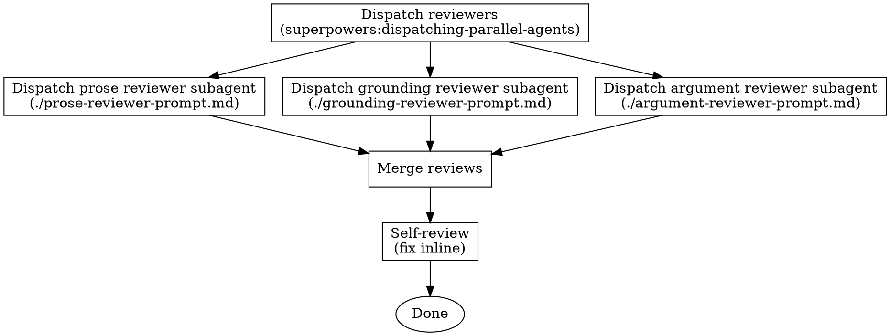

# Revise Article

## Invocation

First, announce:

> "Using **revise-article** to revise `<filename>`."

## Checklist

You MUST create a task with TaskCreate for each of these items and complete them in order unless otherwise stated under "The Process":

1. Review prose
2. Review grounding
3. Review argument
4. Merge reviews
5. Self-review

## The Process



## Prompt Templates

Before dispatching, read both the output file and `<filename>.md` into context. Construct each prompt string by substituting the literal file text inline — subagents do not read files themselves.

- `./prose-reviewer-prompt.md` — prose reviewer subagent prompt
- `./argument-reviewer-prompt.md` — argument reviewer subagent prompt
- `./grounding-reviewer-prompt.md` — grounding reviewer subagent prompt

## After The Reviews

### Step 4 — Merge

After all four sub-agents complete:

1. Collect all footnote markers and definitions from the four intermediate files.
2. Renumber them sequentially (`[^r1]`, `[^r2]`, …) in document order (top to bottom).
3. Write the merged result to `<filename>-reviewed.md` in the same directory as the source.
4. Delete the four intermediate files.

The final `<filename>-reviewed.md` contains the full source text with all footnote markers in place and all footnote definitions at the bottom, unified and sequentially numbered.

### Step 5 — Self-review

After writing the merged file, read it with fresh eyes. This is a checklist you run yourself — not a subagent dispatch.

You MUST manually verify that every `[^rN]` marker in the body has a matching definition at the bottom, and every definition at the bottom has a matching marker in the body. No orphans in either direction.

Fix any issues inline. No need to re-review after fixing — just correct and move on.

## Red Flags

- Never skip any of the reviewer subagents
- Never skil the final self-review
- Less content is better than fabricated content

**Required skills:**
- `superpowers:dispatching-parallel-agents` — run prose, argument, and grounding reviewers simultaneously

--- to subagents
2. **Marker placement:** Verify that every `[^rN]` marker in the body was placed at an existing sentence. DO NOT trust that the reviewer subagents placed them accurately: they may have worked sloppily or even fabricated entire sentences.

3. **Grounding honesty:** Scan the footnotes for any factual claim or citation that was drawn from prior knowledge. Confirm each such claim is appropriately flagged as uncertain, or is supported by a verifiable reference. If a footnote asserts something as fact without a source and without a caveat, add the caveat.

4. **Footnote quality:** Each footnote should contain a dimension tag, an explanation of the issue, and a suggested rewrite. If any footnote is missing one of these elements, add it.
---
Fix any issues inline. No need to re-review after fixing — just correct and move on.

-----------------------

```
/revise <file-path> [focus instruction]
/revise-prose <file-path> [focus instruction]
/revise-argument <file-path> [focus instruction]
/revise-grounding <file-path> [focus instruction]
/revise-citations <file-path> [focus instruction]
```

- **file-path** (required): path to the `.md` file to review.
- **focus instruction** (optional): e.g. "pay particular attention to the argument in paragraph 3". Passed to sub-skills as a priority hint; does not replace full coverage.

## Sub-skill guide

| Sub-skill | Use when… | Do not use when… |
|---|---|---|
| `revise-prose` | Prose is unclear, wordy, passive, or flows poorly | You only need to check scientific accuracy |
| `revise-argument` | The logical structure, paragraph order, or transitions are weak | You only need a prose polish |
| `revise-grounding` | Claims may be unsupported, overclaimed, or inconsistent with the literature | There is no literature context available and the user has waived it |
| `revise-citations` | Claims appear without a supporting reference where one is expected | You only need to check whether existing citations are well-matched |
| `revise` (this skill) | You want a full review across all four dimensions | You want lightweight, single-dimension feedback |

## Workflow

First, announce: "Using **revise** to review `<filename>` across prose, argument, grounding, and citations."

Then use **TaskCreate** to create one task per phase. Mark each task complete before moving to the next.

- Phase 1 — Silent read
- Phase 2 — Revision plan
- Phase 3 — Parallel execution
- Phase 4 — Merge
- Phase 5 — Self-review

## Phase 1 — Silent read

Read the full text at the provided file path. Do not produce any output yet.

Then look for a `references/` folder in the same directory as the file. This folder contains `.md` summaries of relevant research articles.

- **Folder exists:** read all `.md` files silently. These summaries are the primary source for grounding and argument feedback. Any comment on grounding or argument should, where possible, cite the relevant summary explicitly.
- **Folder absent:** stop and ask the user whether they want to provide a `references/` folder or links to relevant literature. Do not proceed until the user responds.
  - If the user provides context: use it and proceed.
  - If the user provides nothing: proceed using prior knowledge as the primary source. This is the only case in which prior knowledge becomes the primary source.

### Prior knowledge policy

When drawing on prior knowledge rather than the provided summaries, support any grounding or argument claim with a specific scientific reference. **Fabricated or unverified citations are strictly prohibited.** When uncertain whether a source is real and directly relevant, flag the uncertainty explicitly rather than cite.

## Phase 2 — Revision plan

Write the revision plan to `<original-name>-revision-plan.md` in the same directory as the source file.

**Format:**

```
# Revision plan: <filename>

## Prose
- [ ] [prose] <affected text span> — <brief diagnostic note>

## Argument
- [ ] [argument] <affected text span> — <brief diagnostic note>

## Grounding
- [ ] [grounding] <affected text span> — <brief diagnostic note, citing source if applicable>

## Citations
- [ ] [citations] <affected text span> — <brief note on what kind of reference is missing>
```

Rules:
- Each item is a diagnostic note only. Do not suggest any rewrite at this stage.
- The affected text span should be short enough to locate the issue unambiguously (5–10 words is usually right).
- Grounding items should cite the relevant reference summary where applicable.

After writing the plan file, explicitly pause and say:

> "Revision plan written to `<path>`. Please review it and check the items you want addressed. Unchecked items will be dropped. Let me know when you're ready to proceed."

Wait for the user's response before continuing.

## Phase 3 — Parallel execution

After plan approval, invoke `superpowers:subagent-driven-development` to dispatch the four sub-skills concurrently.

Each sub-agent receives:
- The approved plan items for its dimension (prose / argument / grounding / citations)
- The file path of the source text
- The path to the `references/` folder (if it exists)
- A footnote offset so numbering does not collide:
  - `revise-prose`: start at `[^r1]`
  - `revise-argument`: start at `[^rA1]` (temporary prefix, resolved in merge)
  - `revise-grounding`: start at `[^rG1]` (temporary prefix, resolved in merge)
  - `revise-citations`: start at `[^rC1]` (temporary prefix, resolved in merge)

Each sub-agent writes its intermediate output to:
- `<original-name>-reviewed-prose.md`
- `<original-name>-reviewed-argument.md`
- `<original-name>-reviewed-grounding.md`
- `<original-name>-reviewed-citations.md`

## Phase 4 — Merge

After all four sub-agents complete:

1. Collect all footnote markers and definitions from the four intermediate files.
2. Renumber them sequentially (`[^r1]`, `[^r2]`, …) in document order (top to bottom).
3. Write the merged result to `<original-name>-reviewed.md` in the same directory as the source.
4. Delete the four intermediate files.

The final `<original-name>-reviewed.md` contains the full source text with all footnote markers in place and all footnote definitions at the bottom, unified and sequentially numbered.

## Phase 5 — Self-review

After writing the merged file, read it with fresh eyes. This is a checklist you run yourself — not a subagent dispatch.

1. **Plan coverage:** For each approved plan item, confirm there is a corresponding footnote in the merged file. List any approved items with no matching annotation and add them if missing.

2. **Marker integrity:** Verify that every `[^rN]` marker in the body has a matching definition at the bottom, and every definition at the bottom has a matching marker in the body. No orphans in either direction.

3. **Grounding honesty:** Scan the footnotes for any factual claim or citation that was drawn from prior knowledge. Confirm each such claim is appropriately flagged as uncertain, or is supported by a verifiable reference. If a footnote asserts something as fact without a source and without a caveat, add the caveat.

4. **Footnote quality:** Each footnote should contain a dimension tag, an explanation of the issue, and a suggested rewrite. If any footnote is missing one of these elements, add it.


## Output format reference

Each footnote in the final file follows this structure:

```
Affected text span[^r1].

---

[^r1]: **[dimension]** Brief explanation of the issue. Suggested rewrite: "…". cf. Source (year).
```

Dimension tag is one of: `[prose]`, `[argument]`, `[grounding]`, `[citations]`.
