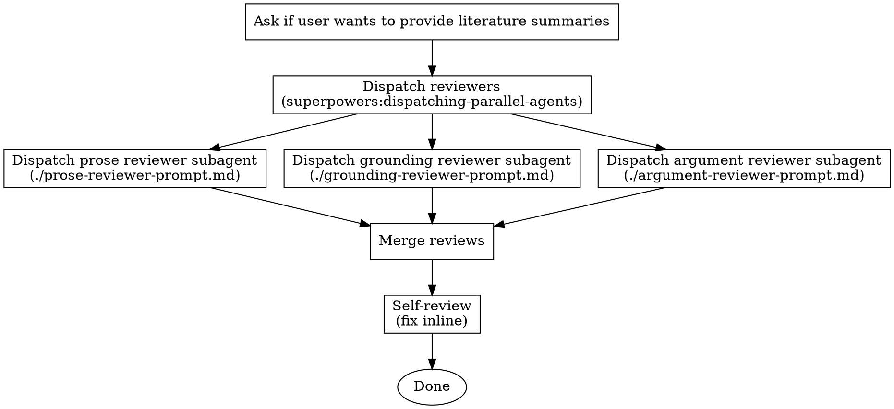
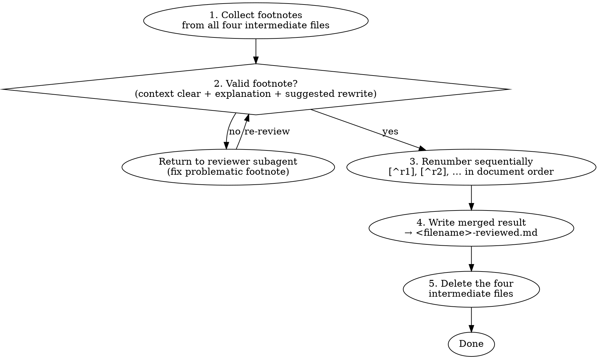

# Review Article

## Invocation

First, announce:

> "Using **review-article** to review `<filename>`."

## Checklist

You MUST create a task with TaskCreate for each of these items and complete them in order:

1. Ask for literature
2. Review prose
3. Review grounding
4. Review argument
5. Merge reviews
6. Self-review

## The Process

## Prompt Templates

Before dispatching, read both the output file and `<filename>.md` into context. Construct each prompt string by substituting the literal file text inline — subagents do not read files themselves.

- `./prose-reviewer-prompt.md` — prose reviewer subagent prompt
- `./argument-reviewer-prompt.md` — argument reviewer subagent prompt
- `./grounding-reviewer-prompt.md` — grounding reviewer subagent prompt

## Model Selection

| Reviewer   | Model  |
|------------|--------|
| Prose      | Haiku  |
| Argument   | Sonnet |
| Grounding  | Sonnet |

## After The Reviews

### Step 4 — Merge

The final `<filename>-reviewed.md` contains the full source text with all footnote markers in place and all footnote definitions at the bottom, unified and sequentially numbered.

### Step 5 — Self-review

After writing the merged file, read it with fresh eyes. This is a checklist you run yourself — not a subagent dispatch.

You MUST thoroughly verify that every `[^rN]` marker in the body has a matching definition at the bottom, and every definition at the bottom has a matching marker in the body. No orphans in either direction.

Fix any issues inline. No need to re-review after fixing — just correct and move on.

## Red Flags

- Never skip any of the reviewer subagents
- Never omit any of the reviewer annotations
- Never skip the final self-review

**Required skills:**
- `superpowers:dispatching-parallel-agents` — run prose, argument, and grounding reviewers simultaneously
