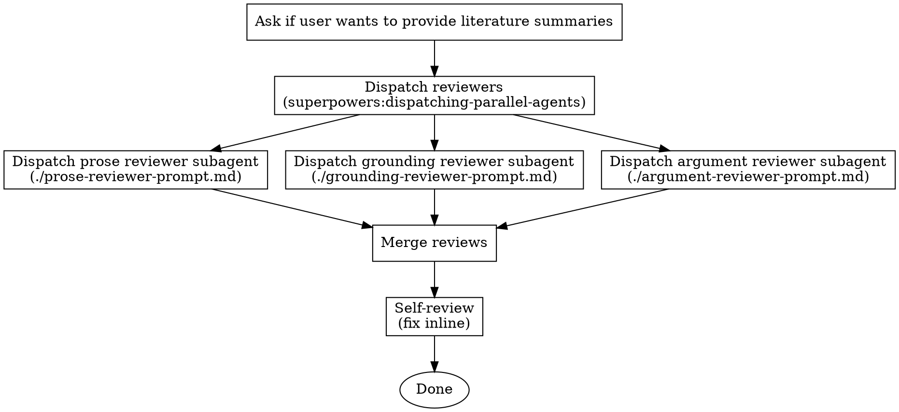
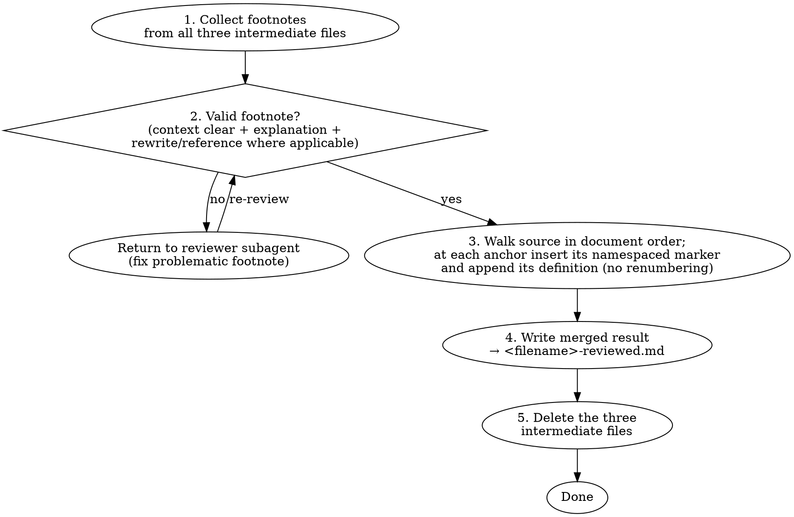

# Review Article

## Invocation

First, announce:

> "Using **review-article** to review `<filename>`."

## Checklist

You MUST create a task with TaskCreate for each of these items and complete them in order:

1. Ask for literature
2. Review prose
3. Review grounding
4. Review argument
5. Merge reviews
6. Self-review

## The Process

```dot
digraph review_article {
    "Ask if user wants to provide literature summaries" [shape=box];
    "Dispatch reviewers\n(superpowers:dispatching-parallel-agents)" [shape=box];
    "Dispatch prose reviewer subagent\n(./prose-reviewer-prompt.md)" [shape=box];
    "Dispatch grounding reviewer subagent\n(./grounding-reviewer-prompt.md)" [shape=box];
    "Dispatch argument reviewer subagent\n(./argument-reviewer-prompt.md)" [shape=box];
    "Merge reviews" [shape=box];
    "Self-review\n(fix inline)" [shape=box];

    "Ask if user wants to provide literature summaries" -> "Dispatch reviewers\n(superpowers:dispatching-parallel-agents)";
    "Dispatch reviewers\n(superpowers:dispatching-parallel-agents)" -> "Dispatch prose reviewer subagent\n(./prose-reviewer-prompt.md)";
    "Dispatch reviewers\n(superpowers:dispatching-parallel-agents)" -> "Dispatch grounding reviewer subagent\n(./grounding-reviewer-prompt.md)";
    "Dispatch reviewers\n(superpowers:dispatching-parallel-agents)" -> "Dispatch argument reviewer subagent\n(./argument-reviewer-prompt.md)";
    "Dispatch prose reviewer subagent\n(./prose-reviewer-prompt.md)" -> "Merge reviews";
    "Dispatch grounding reviewer subagent\n(./grounding-reviewer-prompt.md)" -> "Merge reviews";
    "Dispatch argument reviewer subagent\n(./argument-reviewer-prompt.md)" -> "Merge reviews";
    "Merge reviews" -> "Self-review\n(fix inline)";
    "Self-review\n(fix inline)" -> "Done";
}
```

## Prompt Templates

Do NOT read `<filename>.md` into your own context before dispatching — each reviewer Reads the source itself. For each reviewer, substitute the source path (`<filename>.md`) and the reviewer's output path into its template; the grounding reviewer also gets the literature-summary directory path. Pass paths, never file contents: pasted text stays resident in your context for the whole session and is re-read on every turn.

Output paths:
- prose → `<filename>-prose.md`
- argument → `<filename>-argument.md`
- grounding → `<filename>-grounding.md`

- `./prose-reviewer-prompt.md` — prose reviewer subagent prompt
- `./argument-reviewer-prompt.md` — argument reviewer subagent prompt
- `./grounding-reviewer-prompt.md` — grounding reviewer subagent prompt

## Model Selection

| Reviewer   | Model  |
|------------|--------|
| Prose      | Haiku  |
| Argument   | Sonnet |
| Grounding  | Sonnet |

**Always specify the model explicitly when dispatching a subagent.** An omitted model inherits your session's model — often the most capable and most expensive.

## After The Reviews

### Step 4 — Merge

```dot
digraph footnote_merge {
    collect [label="1. Collect footnotes\nfrom all three intermediate files"]
    check   [label="2. Valid footnote?\n(context clear + explanation +\nrewrite/reference where applicable)", shape=diamond]
    return  [label="Return to reviewer subagent\n(fix problematic footnote)"]
    place   [label="3. Walk source in document order;\nat each anchor insert its namespaced marker\nand append its definition (no renumbering)"]
    write   [label="4. Write merged result\n→ <filename>-reviewed.md"]
    delete  [label="5. Delete the three\nintermediate files"]
    done    [label="Done"]

    collect -> check
    check   -> place  [label="yes"]
    check   -> return [label="no"]
    return  -> check  [label="re-review"]
    place   -> write
    write   -> delete
    delete  -> done
}
```

Read `<filename>.md` once here — you need the source body to place the markers. You deliberately did not load it at dispatch time, so this is the only point the full source enters your context.

Walk the source in document order. At each footnote's `Anchor` sentence, append its namespaced marker (`[^pN]`/`[^aN]`/`[^gN]`) after that sentence and append `<label>: <Note>` to a running definition list. Do NOT renumber: because markers and definitions are both emitted in document order, the file renders as sequential 1, 2, 3… under any Markdown renderer, and the namespaces keep labels from colliding.

The final `<filename>-reviewed.md` contains the full source text with all footnote markers in place and all footnote definitions at the bottom.

### Step 5 — Self-review

After writing the merged file, read it with fresh eyes. This is a checklist you run yourself — not a subagent dispatch.

You MUST thoroughly verify that every footnote marker in the body (`[^pN]`, `[^aN]`, `[^gN]`) has a matching definition at the bottom, and every definition at the bottom has a matching marker in the body. No orphans in either direction.

Fix any issues inline. No need to re-review after fixing — just correct and move on.

### Robustness

The three intermediate files (`<filename>-prose.md`, `-argument.md`, `-grounding.md`) persist on disk until the merge step deletes them. If your context is compacted mid-run, recover by re-reading whichever of these files already exist — do not re-dispatch a reviewer whose output file is already present.

## Red Flags

- Never skip any of the reviewer subagents
- Never omit any of the reviewer annotations
- Never skip the final self-review

**Required skills:**
- `superpowers:dispatching-parallel-agents` — run prose, argument, and grounding reviewers simultaneously
