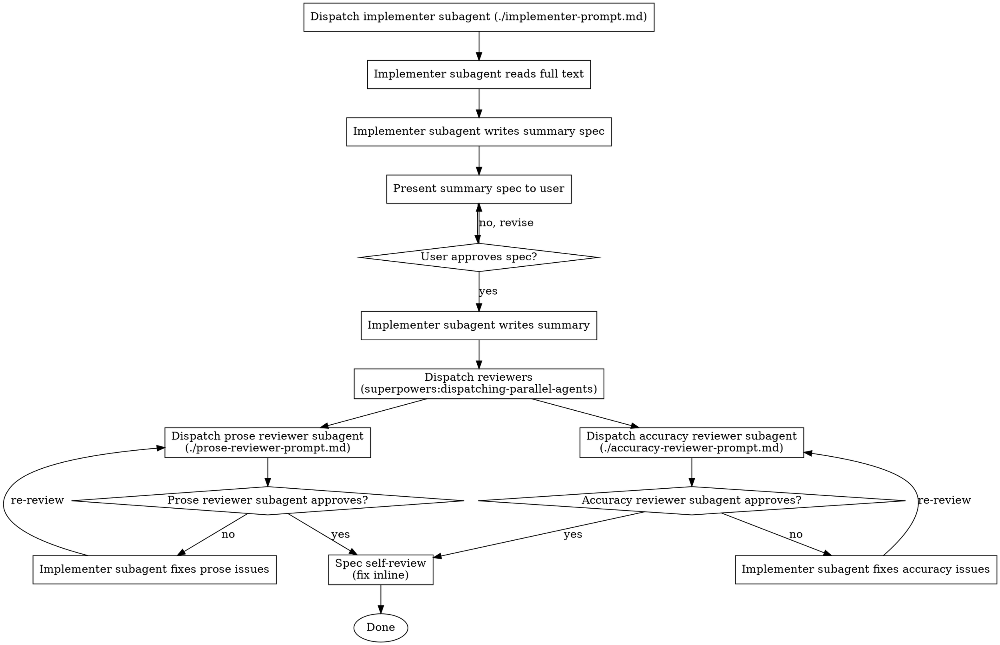

# Summarise Article

## Invocation

First, announce:

> "Using **summarise-article** to summarise `<filename>`."

## Checklist

You MUST create a task with TaskCreate for each of these items and complete them in order unless otherwise stated under "The Process":

1. Read the full article
2. Propose summary spec
3. Write summary
4. Review prose
5. Review accuracy
6. Revise if necessary
7. Spec self-review

## The Process



## The Summary Spec

The summary spec should be EXTREMELY tersely written, only using the bare minimum of words to clearly state the content that should be summarised. Reserve any detail for the full summary written in the "Write summary" step.

## Handling reviewer feedback

Each reviewer returns either a numbered list of issues or confirms no issues. For each issue, write a one-line disposition before revising (e.g. "Issue 3 — fixed: rewrote sentence in active voice"). Address every item; do not skip any. Then overwrite the output file with the revised summary.

## Prompt Templates

Before dispatching, read both the output file and `<article>.txt` into context. Construct each prompt string by substituting the literal file text inline — subagents do not read files themselves.

- `./implementer-prompt.md` — implementer subagent prompt
- `./prose-reviewer-prompt.md` — prose reviewer subagent prompt
- `./accuracy-reviewer-prompt.md` — accuracy reviewer subagent prompt

## Model Selection

| Reviewer    | Model  |
|-------------|--------|
| Implementer | Sonnet |
| Prose       | Haiku  |
| Accuracy    | Sonnet |

## Example Workflow

```
You: /summarise-article <article>.txt → summaries/<id>.toml

Using summarise-article to summarise <article>.txt.
Output: summaries/<id>.toml  (id = lastname_year)

[Create tasks as in numbered list under Checklist header]

[Read <article>.txt in full — no output]

Proposed spec for <id>.toml:
  tags: [tag1, tag2, tag3, ...]
  research_question: [VERY BRIEF bullet list]
  background:        [VERY BRIEF bullet list]
  methods:           [VERY BRIEF bullet list]
  findings:          [VERY BRIEF bullet list]
  conclusion:        [VERY BRIEF bullet list]

User: Looks good, but add [new tag] as a tag.

[Revised tags, re-presented]

User: Approved.

[Write the TOML record to summaries/<id>.toml]
[Dispatch prose reviewer and accuracy reviewer in parallel]

Prose reviewer: 2 issues
  - Issue 1: [prose issue]
  - Issue 2: [prose issue]

Accuracy reviewer: 1 issue
  - Issue 3: [accuracy issue]

Dispositions:
  Issue 1 — fixed: [description]
  Issue 2 — fixed: [description]
  Issue 3 — fixed: [description]

[Overwrite summaries/<id>.toml]

Spec self-review:
  - All five content fields represented ✅
  - All metadata fields populated ✅
  - No content found outside approved spec ✅
  - File parses as TOML ✅

[Summary written to summaries/<id>.toml.]
```

## Output Format

The summary is a single TOML record written to `summaries/<id>.toml`. The filename stem equals the `id` field.

**`id`** — `lastname_year`: lowercase first-author family name plus the publication year (e.g. `klareskog_2009`). Non-ASCII letters are kept (e.g. `svärd_2015`). If a record for the same author and year already exists in `summaries/`, append a disambiguation letter: `duarte_2024`, then `duarte_2024a`, `duarte_2024b`, …

The record MUST contain these fields, metadata first, then the five content fields as triple-quoted (`"""`) multiline strings:

```toml
id = "klareskog_2009"
authors = ["Klareskog L", "Catrina AI", "Paget S"]
year = 2009
title = "Rheumatoid arthritis"
journal = "The Lancet"
doi = "10.1016/S0140-6736(09)60008-8"
tags = ["rheumatoid-arthritis", "review", "pathogenesis"]

research_question = """
One or two sentences stating what question the paper addresses.
"""

background = """
Context and motivation: what was known before, what gap this study fills, why the question matters.
"""

methods = """
Brief description of study design, data, and analytic approach. Enough for the reader to judge applicability — no exhaustive detail.
"""

findings = """
Narrative prose. Each finding may carry a small cluster of closely related numbers (e.g. rates across compared groups in one sentence). Omit findings that add length without adding understanding. NEVER provide a results table.
"""

conclusion = """
What the paper concludes and what it means for the field or for practice.
"""
```

**Metadata sources:** Take `authors`, `year`, `title`, `journal`, and `doi` from the article's own bibliographic information. Format every author as `"Family II"` — family name plus the uppercased initials of each given name, no periods (e.g. "Aletaha D", "Catrina AI"). `authors[1]` is the first author.

**Tag guidance:** Concise, lowercase, hyphenated multi-word tags covering topic area and method type. Follow the project's `notes/tag-conventions.md` where one applies.

## Hard Rules

- **All metadata fields are required:** `id`, `authors`, `year`, `title`, `journal`, `doi`, `tags`. Leave a string empty (`""`) only if the article genuinely lacks it (e.g. a missing DOI); never invent one.
- **Exactly five content fields:** `research_question`, `background`, `methods`, `findings`, `conclusion`. Do not add, rename, or remove fields. No "overview", "key_results", "discussion", "limitations", "strengths", or "contextual_relevance".
- **Content fields are triple-quoted strings.** Use narrative prose inside them; no Markdown headings.
- **No tables.** Findings must be narrative prose only. Present numbers inline in sentences.
- **Up to five findings.** Each may include a small cluster of related numbers in one sentence. Include only findings necessary to convey the result.
- **No limitations.** Limitations are out of scope for this record.
- **The file must parse as TOML.** A content value may not contain a literal `"""`.

## Red Flags

- Never write the summary before the spec is approved
- Never skip either reviewer subagent
- Never skip the spec self-review
- Never leave reviewer issues unaddressed — every item gets a disposition
- If a finding appears in the summary but not in the approved spec, remove it
- Less content is better than fabricated content
- If an approved spec bullet is missing from the summary, add it before overwriting

## Integration

**Required skills:**
- `superpowers:dispatching-parallel-agents` — run prose and accuracy reviewers simultaneously
