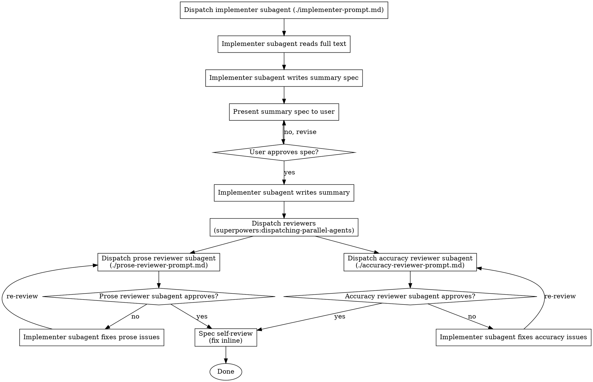

# Summarise Article

## Invocation

First, announce:

> "Using **summarise-article** to summarise `<filename>`."

Then resolve the output path:

| User provides | Output path |
|---------------|-------------|
| Full path with filename | Use as-is |
| Directory path only | `<dir>/<article>.md` |
| Nothing | Ask: "Where should the summary be saved?" Wait for the answer before proceeding. |

Always resolve the output path before creating any tasks.

## Checklist

You MUST create a task for each of these items and complete them in order:

1. Read the article in full
2. Propose summary spec (tags + bullet-point spec per section) — wait for user approval
3. Write summary using `elements-of-style:writing-clearly-and-concisely`
4. Run parallel review via `superpowers:dispatching-parallel-agents`
5. Revise: if any issues were raised, write a one-line disposition per issue and overwrite the output file; if neither reviewer found issues, skip to step 6
6. Spec self-review: verify summary matches approved spec (fix inline)

## The Process



## Handling reviewer feedback

Each reviewer returns either a numbered list of issues or confirms no issues. For each issue, write a one-line disposition before revising (e.g. "Issue 3 — fixed: rewrote sentence in active voice"). Address every item; do not skip any. Then overwrite the output file with the revised summary.

## Prompt Templates

Before dispatching, read both the output file and `<article>.txt` into context. Construct each prompt string by substituting the literal file text inline — subagents do not read files themselves.

- `./impelementer-prompt.md` — implementer subagent prompt
- `./prose-reviewer-prompt.md` — prose reviewer subagent prompt
- `./accuracy-reviewer-prompt.md` — accuracy reviewer subagent prompt

## Example Workflow

```
You: /summarise-article smith2023.txt → summaries/smith2023.md

Using summarise-article to summarise smith2023.txt.
Output: summaries/smith2023.md

[Create tasks: Read, Propose spec, Write, Review, Revise, Spec self-review]

[Read smith2023.txt in full — no output]

---
tags: [tag1, tag2, tag3, ...]

## Research question
[research question bullet list]

## Background
[background bullet list]

## Methods
[methods bullet list]

## Findings
[findings bullet list]

## Conclusion
[conclusion bullet list]
---

User: Looks good, but add [new tag] as a tag.

[Revised tags, re-presented]

User: Approved.

[Write summary to summaries/smith2023.md]
[Dispatch prose reviewer and accuracy reviewer in parallel]

Prose reviewer: 2 issues
  - Issue 1: [prose issue]
  - Issue 2: [prose issue]

Accuracy reviewer: 1 issue
  - Issue 3: [accuracy issue]

Dispositions:
  Issue 1 — fixed: [description]
  Issue 2 — fixed: [description]
  Issue 3 — fixed: [description]

[Overwrite summaries/smith2023.md]

Spec self-review:
  - All five spec bullets represented ✅
  - No content found outside approved spec ✅

Summary smith2023.md written to summaries/smith2023.md.
```

## Output Format

The summary MUST use these elements in this order:

```markdown
---
tags: [tag1, tag2, ...]
---

# Summary: Author et al. (Year)

**Citation:** Short reference providing first three authors, year, and a doi link (Example: [Snow J, Ruckus B, Legrand C, et al. (2012)](example.doi)).

---

## Research question

One or two sentences stating what question the paper addresses.

## Background

Context and motivation: what was known before, what gap this study fills, why the question matters.

## Methods

Brief description of study design, data, and analytic approach. Enough for the reader to judge applicability — no exhaustive detail.

## Findings

Narrative prose. Include up to five key findings inline; each finding may carry a small cluster of closely related numbers (e.g. rates across compared groups in one sentence). Omit findings that add length without adding understanding. Do not use a results table.

## Conclusion

What the paper concludes and what it means for the field or for practice.
```

**Tag guidance:** Concise, lowercase, hyphenated multi-word tags. Cover topic area, method type, disease/population, and any dimension useful for filtering a collection of summaries (e.g., `rheumatoid-arthritis`, `treat-to-target`, `meta-analysis`, `radiographic-progression`).

## Hard Rules

- **YAML frontmatter is required.** Do not omit the `---` tags block. Tags must be present.
- **Exactly five sections:** Research question, Background, Methods, Findings, Conclusion. Do not add, rename, or remove sections. No "Overview", "Key Results", "Discussion", "Limitations", "Strengths", or "Contextual relevance" sections.
- **No Markdown tables.** Findings must be narrative prose only. Present numbers inline in sentences, not in table rows.
- **Up to five findings.** Each finding may include a small cluster of related numbers in one sentence. Include only findings necessary to convey the result.
- **No Limitations section.** Limitations are out of scope for this summary format.

## Red Flags

- Never write the summary before the spec is approved
- Never skip either reviewer subagent
- Never skip the spec self-review
- Never leave reviewer issues unaddressed — every item gets a disposition
- If a finding appears in the summary but not in the approved spec, remove it
- Less content is better than fabricated content
- If an approved spec bullet is missing from the summary, add it before overwriting

## Integration

**Required skills:**
- `elements-of-style:writing-clearly-and-concisely` — load during the write phase; informs prose style throughout
- `superpowers:dispatching-parallel-agents` — run prose and accuracy reviewers simultaneously
