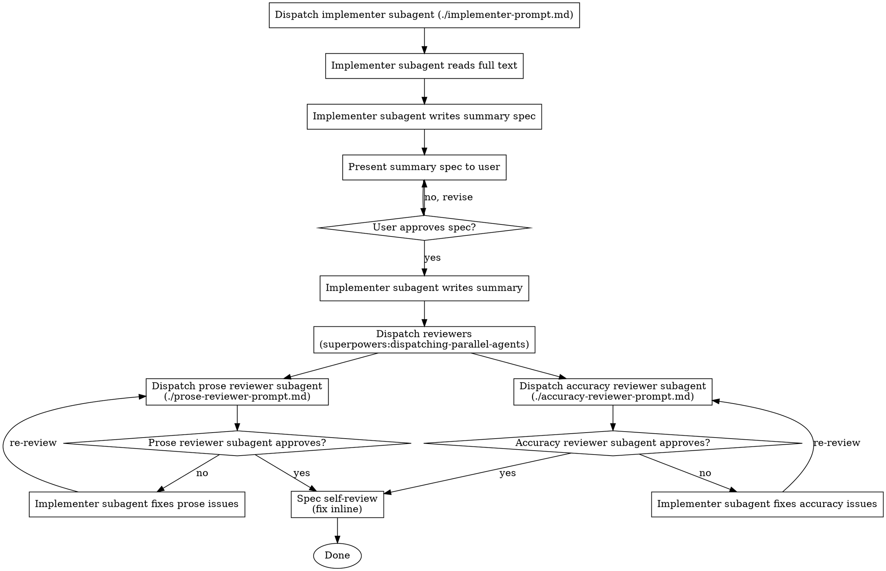

# Summarise Article

## Invocation

First, announce:

> "Using **summarise-article** to summarise `<filename>`."

Then resolve the output path:

| User provides | Output path |
|---------------|-------------|
| Full path with filename | Use as-is |
| Directory path only | `<dir>/<article>.md` |
| Nothing | `summaries/<article>.md` |

Always resolve the output path before creating any tasks.

## Checklist

You MUST create a task with TaskCreate for each of these items and complete them in order unless otherwise stated under "The Process":

1. Read the full article
2. Propose summary spec
3. Write summary
4. Review prose
5. Review accuracy
6. Revise if necessary
7. Spec self-review

## The Process



## The Summary Spec

The summary spec should be EXTREMELY tersely written, only using the bare minimum of words to clearly state the content that should be summarised. Reverse any detail for the full summary written in the "Write summary" step.

## Handling reviewer feedback

Each reviewer returns either a numbered list of issues or confirms no issues. For each issue, write a one-line disposition before revising (e.g. "Issue 3 — fixed: rewrote sentence in active voice"). Address every item; do not skip any. Then overwrite the output file with the revised summary.

## Prompt Templates

Before dispatching, read both the output file and `<article>.txt` into context. Construct each prompt string by substituting the literal file text inline — subagents do not read files themselves.

- `./impelementer-prompt.md` — implementer subagent prompt
- `./prose-reviewer-prompt.md` — prose reviewer subagent prompt
- `./accuracy-reviewer-prompt.md` — accuracy reviewer subagent prompt

## Example Workflow

```
You: /summarise-article <article>.txt → article-summaries/<article>.md

Using summarise-article to summarise <article>.txt.
Output: article-summaries/<article>.md

[Create tasks as in numbered list under Checklist header]

[Read <article>.txt in full — no output]

---
tags: [tag1, tag2, tag3, ...]

## Research question
[research question VERY BRIEF bullet list]

## Background
[background VERY BRIEF bullet list]

## Methods
[methods VERY BRIEF bullet list]

## Findings
[findings VERY BRIEF bullet list]

## Conclusion
[conclusion VERY BRIEF bullet list]
---

Spec <article>-spec.md written to article-summaries/<article>-spec.md.

User: Looks good, but add [new tag] as a tag.

[Revised tags, re-presented]

User: Approved.

[Write summary to article-summaries/<article>.md]
[Dispatch prose reviewer and accuracy reviewer in parallel]

Prose reviewer: 2 issues
  - Issue 1: [prose issue]
  - Issue 2: [prose issue]

Accuracy reviewer: 1 issue
  - Issue 3: [accuracy issue]

Dispositions:
  Issue 1 — fixed: [description]
  Issue 2 — fixed: [description]
  Issue 3 — fixed: [description]

[Overwrite article-summaries/<article>.md]

Spec self-review:
  - All five spec bullets represented ✅
  - No content found outside approved spec ✅

Summary <article>.md written to article-summaries/<article>.md.
```

## Output Format

The summary MUST use these elements in this order:

```markdown
---
tags: [tag1, tag2, ...]
---

# Summary: Author et al. (Year)

**Citation:** Short reference providing first three authors, year, and a doi link (Example: [Snow J, Ruckus B, Legrand C, et al. (2012)](example.doi)).

---

## Research question

One or two sentences stating what question the paper addresses.

## Background

Context and motivation: what was known before, what gap this study fills, why the question matters.

## Methods

Brief description of study design, data, and analytic approach. Enough for the reader to judge applicability — no exhaustive detail.

## Findings

Narrative prose. Each finding may carry a small cluster of closely related numbers (e.g. rates across compared groups in one sentence). Omit findings that add length without adding understanding. NEVER provide a full results table.

## Conclusion

What the paper concludes and what it means for the field or for practice.
```

**Tag guidance:** Concise, lowercase, hyphenated multi-word tags. Cover topic area, and method type.

## Hard Rules

- **YAML frontmatter is required.** Do not omit the `---` tags block. Tags must be present.
- **Exactly five sections:** Research question, Background, Methods, Findings, Conclusion. Do not add, rename, or remove sections. No "Overview", "Key Results", "Discussion", "Limitations", "Strengths", or "Contextual relevance" sections.
- **No Markdown tables.** Findings must be narrative prose only. Present numbers inline in sentences, not in table rows.
- **Up to five findings.** Each finding may include a small cluster of related numbers in one sentence. Include only findings necessary to convey the result.
- **No Limitations section.** Limitations are out of scope for this summary format.

## Red Flags

- Never write the summary before the spec is approved
- Never skip either reviewer subagent
- Never skip the spec self-review
- Never leave reviewer issues unaddressed — every item gets a disposition
- If a finding appears in the summary but not in the approved spec, remove it
- Less content is better than fabricated content
- If an approved spec bullet is missing from the summary, add it before overwriting

## Integration

**Required skills:**
- `superpowers:dispatching-parallel-agents` — run prose and accuracy reviewers simultaneously
